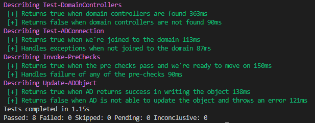

# Active Directory Canary Test Script

Check Active Directory replication health. 
Using as an example to test docker deployment... eventually. 

Manual Testing:
`Invoke-Pester`

I lost interest in this when reviewing the AD REplication Tool: https://www.microsoft.com/en-us/download/details.aspx?id=30005 which _looks_ like some of the tooling to come out of the ADRAP when we were experimenting with the cave framework. 
